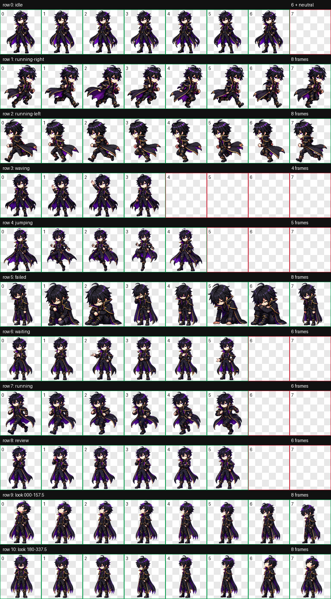

# Shadow Eminence — Codex Pet V2.1 Enhanced

A fan-made custom pet for Codex inspired by *The Eminence in Shadow*.

This package uses the Codex V2 pet format and includes a 16-direction look system plus an enhanced six-frame idle loop with subtle breathing, a blink, and gentle cape movement.



## Features

- Codex pet format V2
- 1536×2288 RGBA spritesheet
- 8×11 layout with 192×208 cells
- 16 validated look directions
- 9 standard state animations preserved
- Enhanced six-frame idle animation
- Zero magenta-edge residues in final QA
- Separate pet identifier: `shadow-eminence-v2-1-enhanced`

## Installation

### Windows

1. Download or clone this repository.
2. Create this folder:

```text
%USERPROFILE%\.codex\pets\shadow-eminence-v2-1-enhanced
```

3. Copy at minimum these files into that folder:

```text
pet.json
spritesheet.png
```

4. Restart Codex if the pet does not appear immediately.
5. Open **Settings → Pets** and select **Shadow Eminence V2.1 Enhanced**.

### macOS / Linux

1. Download or clone this repository.
2. Create this folder:

```text
~/.codex/pets/shadow-eminence-v2-1-enhanced
```

3. Copy at minimum:

```text
pet.json
spritesheet.png
```

4. Restart Codex if necessary.
5. Open **Settings → Pets** and select **Shadow Eminence V2.1 Enhanced**.

## Files

- `pet.json` — Codex pet manifest
- `spritesheet.png` — primary V2 spritesheet
- `spritesheet.webp` — alternate optimized copy
- `preview-contact-sheet.png` — animation/contact-sheet preview
- `preview-look-directions.png` — 16-direction preview
- `enhanced-final-qa-report.json` — final QA summary

## Enhanced changes

V2.1 Enhanced changes only the idle row.

The six-frame loop adds:

- subtle breathing
- one blink
- gentle attached cape sway

The remaining standard animations and all 16 look directions are preserved from the validated V2 base.

## Technical QA

- Atlas: 1536×2288
- Format: PNG RGBA
- Layout: V2 8×11
- Cell size: 192×208
- Magenta residues: 0
- Atlas validation: pass
- Standard animations: pass
- 16 look directions: validated
- `pet.json`: valid

See [`enhanced-final-qa-report.json`](enhanced-final-qa-report.json).

## Compatibility notes

Custom cursor, click, drag, and selection reactions are not included because the current supported pet state system does not expose those custom events.

Detached aura or floating-shadow effects and an additional special state were also intentionally omitted to preserve readability and V2 compatibility.

## Uninstall

Delete this folder on Windows:

```text
%USERPROFILE%\.codex\pets\shadow-eminence-v2-1-enhanced
```

Or on macOS/Linux:

```text
~/.codex/pets/shadow-eminence-v2-1-enhanced
```

Then restart Codex if needed.

## Fan-project notice

This is an unofficial, non-commercial fan project inspired by *The Eminence in Shadow*.

The original series, characters, names, trademarks, and other protected material belong to their respective rights holders.

This repository is not affiliated with or endorsed by the original rights holders or by OpenAI.

The presence of configuration/source files in this repository should not be interpreted as granting rights over third-party intellectual property depicted in the fan-made assets.

## Version

Current public build: **V2.1 Enhanced**
